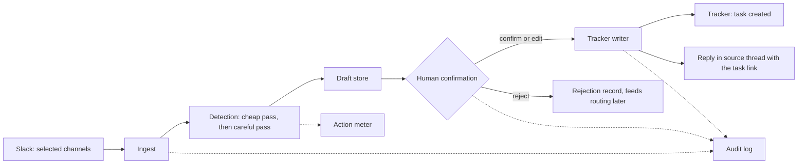

# Seros — product repository

This repository will hold the Seros product: the service that turns what a team already
said in chat into confirmed, owned, dated tasks in the tracker the team already pays for.

**Status: pre-code.** There is no application code here yet, and that is deliberate. The
language, runtime, framework, hosting target and model provider have not been chosen. See
[docs/adr/0003-language-and-runtime.md](docs/adr/0003-language-and-runtime.md) and
[docs/adr/0004-model-provider-strategy.md](docs/adr/0004-model-provider-strategy.md);
both are PROPOSED, neither is accepted. Writing code before those are decided would decide
them by accident.

What exists today is the specification: what v0 is, what the data looks like, what the
security controls have to be, what the integrations may touch, how a non-deterministic
system gets tested, and what to do at 3am when one person is on call.

## The v0 loop

One loop, end to end. Everything else in this repository exists to serve it.

```
  Slack workspace
        |
        |  (1) read only the channels the admin picked
        v
  +--------------+     (2) batch      +---------------------+
  | Slack ingest | -----------------> | Detection pipeline  |
  +--------------+                    |  cheap pass first,  |
        ^                             |  careful pass only  |
        |                             |  on survivors       |
        |                             +----------+----------+
        |                                        | (3) candidate
        |                                        v
        |                             +---------------------+
        |                             | Draft store         |
        |                             |  title, outcome,    |
        |                             |  owner, due, source |
        |                             +----------+----------+
        |                                        | (4) shown in queue
        |                                        v
        |                             +---------------------+
        |     (6) permalink back      | HUMAN CONFIRMATION  |
        +-----------------------------|  confirm / edit /   |
                                      |  reject             |
                                      +----------+----------+
                                                 | (5) only now
                                                 v
                                      +---------------------+
                                      | Tracker writer      | --> Tracker
                                      +---------------------+

  Every step writes to the audit log. Every model call writes to the meter.
```

The same loop as a diagram, for rendering:



Plus the 7-day replay: run the same detection over the last seven days of history at
connect time, and show the customer the gap between what was committed and what was
tracked. The replay is the demo, the activation event and the first invoice argument, so
it is not a separate feature — it is the same pipeline pointed at the past.

## The three rules the codebase must keep

These are not style preferences. They are the promises made in the terms, on the website,
and in the data processing agreement. Code that breaks one of them is a defect regardless
of whether a test fails.

| Rule | What it means in code | Where it is promised |
|---|---|---|
| **1. Human confirmation before any write** | No code path creates, updates, assigns or comments on anything in a customer's tracker or chat without a recorded `Confirmation` row carrying a real user id. There is no configuration flag that disables this in v0. | ADR 0002; product terms; the roadmap's v0 scope |
| **2. No customer content in logs** | Log identifiers, counts, durations, error classes. Never message text, task titles, quoted context, user names or email addresses. Structured logging with an allowlist of fields, not a denylist. | Security page; DPA data minimisation |
| **3. Every model call is metered** | No provider call without a recorded `ActionMeter` row carrying workspace, purpose, model, token counts and estimated cost, written in the same transaction boundary as the call result. An unmetered call is an unbounded liability. | Cost-per-action is the internal number the business plan depends on |

Rule 1 has a mechanical form: the tracker writer takes a confirmation id, not a draft id.
Rule 3 has a mechanical form: the provider client is the only thing allowed to open a
socket to a model API, and it refuses to run without a meter context.

## Where the documentation lives

| File | What it answers |
|---|---|
| [docs/ARCHITECTURE.md](docs/ARCHITECTURE.md) | What the v0 system is made of, how data flows, where the trust boundaries and the model calls are, what happens when something is down, how cost is contained |
| [docs/DATA-MODEL.md](docs/DATA-MODEL.md) | The entities, their fields, what counts as customer content, and the retention class of every table |
| [docs/SECURITY-CONTROLS.md](docs/SECURITY-CONTROLS.md) | Each security promise in the legal pack mapped to the engineering control that would satisfy it, and its status |
| [docs/INTEGRATIONS.md](docs/INTEGRATIONS.md) | Scopes requested from Slack and the tracker, why each one, what is read, what is written, what breaks without it |
| [docs/TESTING-STRATEGY.md](docs/TESTING-STRATEGY.md) | How to test a system whose core is a language model |
| [docs/RUNBOOK.md](docs/RUNBOOK.md) | On-call for one person |
| [docs/adr/](docs/adr/0001-record-architecture-decisions.md) | Decisions, with their context and consequences, in the order they were made |
| [CONTRIBUTING.md](CONTRIBUTING.md) | How to work in this repository |

Business context (roadmap, metrics, pricing, operations) and the legal pack (terms,
privacy policy, DPA, security page) live in the company's other repositories. They are
referenced here by name rather than by link, because a relative link across repository
boundaries breaks the moment this repository is cloned on its own.

## Getting set up, once code exists

This section is a placeholder with a shape, so that the first commit of real code has
somewhere obvious to go. Do not fill it in with a guess.

1. Prerequisites: `[[RUNTIME_AND_VERSION]]`, `[[PACKAGE_MANAGER]]`, a local database, and
   a container runtime if the local stack needs one.
2. `cp .env.example .env` and fill in: Slack app credentials for a development workspace,
   tracker sandbox credentials, one model provider key, a database URL, an encryption key
   for connection secrets.
3. Install dependencies, run migrations, seed a demo workspace with the anonymised fixture
   threads described in [docs/TESTING-STRATEGY.md](docs/TESTING-STRATEGY.md).
4. Run the test suite. It must pass offline: no test may require a live model provider.
5. Start the app and the worker. Point a Slack development app at a tunnel.
6. Confirm one draft end to end into a tracker sandbox. If that works, the environment is
   correct; if it does not, nothing else matters yet.

Until then, the only thing to run in this repository is the documentation check in
[.github/workflows/docs-checks.yml](.github/workflows/docs-checks.yml).

## Assumptions in this repository

Every document here marks its assumptions. The repository-wide ones:

- **A1.** v0 is Slack plus exactly one tracker. The tracker is chosen from design partner
  demand, not preference, and that choice is not made in this repository.
- **A2.** Deployment is multi-tenant, cloud, US-hosted. No self-hosting, no on-premise.
- **A3.** Model inference is bought from third-party providers. No model is trained or
  fine-tuned on customer content, ever, and no customer content is sent to a provider on
  terms that allow training.
- **A4.** One engineer. Every design here is judged partly on whether one person can
  operate it while asleep.
- **A5.** Customer content is regulated personal data in some jurisdictions even when it
  is only work chat, so retention and deletion are engineering requirements, not features.

## Licence

Proprietary. See [LICENSE](LICENSE).
