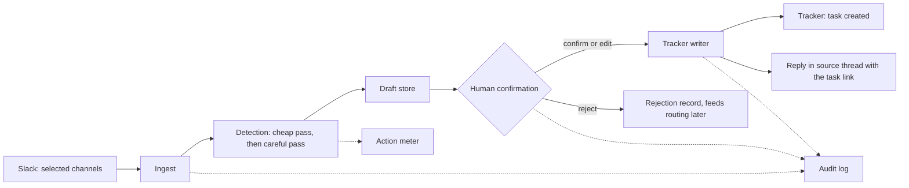

# Seros — product repository

This repository is the specification of a paused Seros product: a service designed to turn
what a team already said in chat into confirmed, owned, dated tasks in the tracker the team
already used.

**Status: specified; the implementation is paused.** This repository is the specification.
The application itself lives in [Seros-LLC/app](https://github.com/Seros-LLC/app), built
against the brief in [docs/IMPLEMENTATION-BRIEF.md](docs/IMPLEMENTATION-BRIEF.md). Seros,
LLC is now an [AI and agentic consulting firm](https://seros.dev) and this product is not
deployed or sold — see [COMPANY.md](COMPANY.md). The specification is published because the
engineering reasoning in it stands on its own.

The language question is settled: [ADR 0005](docs/adr/0005-language-and-runtime-typescript.md)
records TypeScript on Node and supersedes [ADR 0003](docs/adr/0003-language-and-runtime.md),
with the two competing spikes committed under [`spikes/`](spikes) and an honest account of
which parts of 0003's method were skipped. The model provider question is formally open:
[ADR 0004](docs/adr/0004-model-provider-strategy.md) is still PROPOSED. In practice, before
the application was paused its production deployment ran Google Gemini (via the
OpenAI-compatible endpoint) in front of the local-Qwen fallback, through the abstraction and
ordered transport chain that ADR requires. Development and tests run local Qwen 7b or the
deterministic fake.

What this repository holds is the specification: what v0 was, what the data looks like,
what the security controls had to be, what the integrations could touch, how a
non-deterministic system gets tested, and what to do at 3am when one person is on call.

## The v0 loop

One loop, end to end. Everything else in this repository was written to serve it.

```
  Slack workspace
        |
        |  (1) read only the channels the admin picked
        v
  +--------------+     (2) batch      +---------------------+
  | Slack ingest | -----------------> | Detection pipeline  |
  +--------------+                    |  cheap pass first,  |
        ^                             |  careful pass only  |
        |                             |  on survivors       |
        |                             +----------+----------+
        |                                        | (3) candidate
        |                                        v
        |                             +---------------------+
        |                             | Draft store         |
        |                             |  title, outcome,    |
        |                             |  owner, due, source |
        |                             +----------+----------+
        |                                        | (4) shown in queue
        |                                        v
        |                             +---------------------+
        |     (6) permalink back      | HUMAN CONFIRMATION  |
        +-----------------------------|  confirm / edit /   |
                                      |  reject             |
                                      +----------+----------+
                                                 | (5) only now
                                                 v
                                      +---------------------+
                                      | Tracker writer      | --> Tracker
                                      +---------------------+

  Every step writes to the audit log. Every model call writes to the meter.
```

The same loop as a diagram, for rendering:


```mermaid
flowchart LR
    S[Slack: selected channels] --> I[Ingest]
    I --> D[Detection: cheap pass, then careful pass]
    D --> DR[Draft store]
    DR --> C{Human confirmation}
    C -- confirm or edit --> W[Tracker writer]
    C -- reject --> R[Rejection record, feeds routing later]
    W --> T[Tracker: task created]
    W --> B[Reply in source thread with the task link]
    I -.-> A[Audit log]
    D -.-> M[Action meter]
    C -.-> A
    W -.-> A
```

Plus the 7-day replay: run the same detection over the last seven days of history at
connect time, and show the gap between what was committed and what was tracked. The replay
was not a separate feature: it is the same pipeline pointed at the past.

## The three rules the codebase must keep

These are not style preferences. They were the product's draft commitments, written for its
terms, product pages and data processing agreement before the product was paused; they are
kept here as the historical basis of the design. Code that breaks one of them is a defect
regardless of whether a test fails.

| Rule | What it means in code | Where it was committed (historical) |
|---|---|---|
| **1. Human confirmation before any write** | No code path creates, updates, assigns or comments on anything in a customer's tracker or chat without a recorded `Confirmation` row carrying a real user id. There is no configuration flag that disables this in v0. | ADR 0002; draft product terms; v0 scope |
| **2. No customer content in logs** | Log identifiers, counts, durations, error classes. Never message text, task titles, quoted context, user names or email addresses. Structured logging with an allowlist of fields, not a denylist. | Draft security page; draft DPA data minimisation |
| **3. Every model call is metered** | No provider call without a recorded `ActionMeter` row carrying workspace, purpose, model, token counts and estimated cost, written in the same transaction boundary as the call result. An unmetered call is an unbounded liability. | ADR 0004; cost per action was the product's key unit cost |

Rule 1 has a mechanical form: the tracker writer takes a confirmation id, not a draft id.
Rule 3 has a mechanical form: the provider client is the only thing allowed to open a
socket to a model API, and it refuses to run without a meter context.

## Where the documentation lives

| File | What it answers |
|---|---|
| [docs/ARCHITECTURE.md](docs/ARCHITECTURE.md) | What the v0 system is made of, how data flows, where the trust boundaries and the model calls are, what happens when something is down, how cost is contained |
| [docs/DATA-MODEL.md](docs/DATA-MODEL.md) | The entities, their fields, what counts as customer content, and the retention class of every table |
| [docs/SECURITY-CONTROLS.md](docs/SECURITY-CONTROLS.md) | Each security commitment drafted for the product mapped to the engineering control that would satisfy it, and its status |
| [docs/INTEGRATIONS.md](docs/INTEGRATIONS.md) | Scopes requested from Slack and the tracker, why each one, what is read, what is written, what breaks without it |
| [docs/TESTING-STRATEGY.md](docs/TESTING-STRATEGY.md) | How to test a system whose core is a language model |
| [docs/RUNBOOK.md](docs/RUNBOOK.md) | On-call for one person |
| [docs/adr/](docs/adr/0001-record-architecture-decisions.md) | Decisions, with their context and consequences, in the order they were made |
| [CONTRIBUTING.md](CONTRIBUTING.md) | How to work in this repository |

Material outside this repository (the application, the website and its legal pages) is
referenced by repository name or absolute URL rather than by relative link, because a
relative link across repository boundaries breaks the moment this repository is cloned on
its own.

## Running the application

The application has its own setup, configuration and test instructions in the
[Seros-LLC/app README](https://github.com/Seros-LLC/app#readme). The only thing to run in
this repository is the documentation check in
[.github/workflows/docs-checks.yml](.github/workflows/docs-checks.yml).

## Assumptions in this repository

Every document here marks its assumptions. The repository-wide ones:

- **A1.** v0 is Slack plus exactly one tracker. The choice of tracker was not made in this
  repository.
- **A2.** Deployment is multi-tenant, cloud, US-hosted. No self-hosting, no on-premise.
- **A3.** Model inference is bought from third-party providers. No model is trained or
  fine-tuned on customer content, ever, and no customer content is sent to a provider on
  terms that allow training.
- **A4.** One engineer. Every design here is judged partly on whether one person can
  operate it while asleep.
- **A5.** Customer content is regulated personal data in some jurisdictions even when it
  is only work chat, so retention and deletion are engineering requirements, not features.

## Licence

Proprietary. See [LICENSE](LICENSE).
