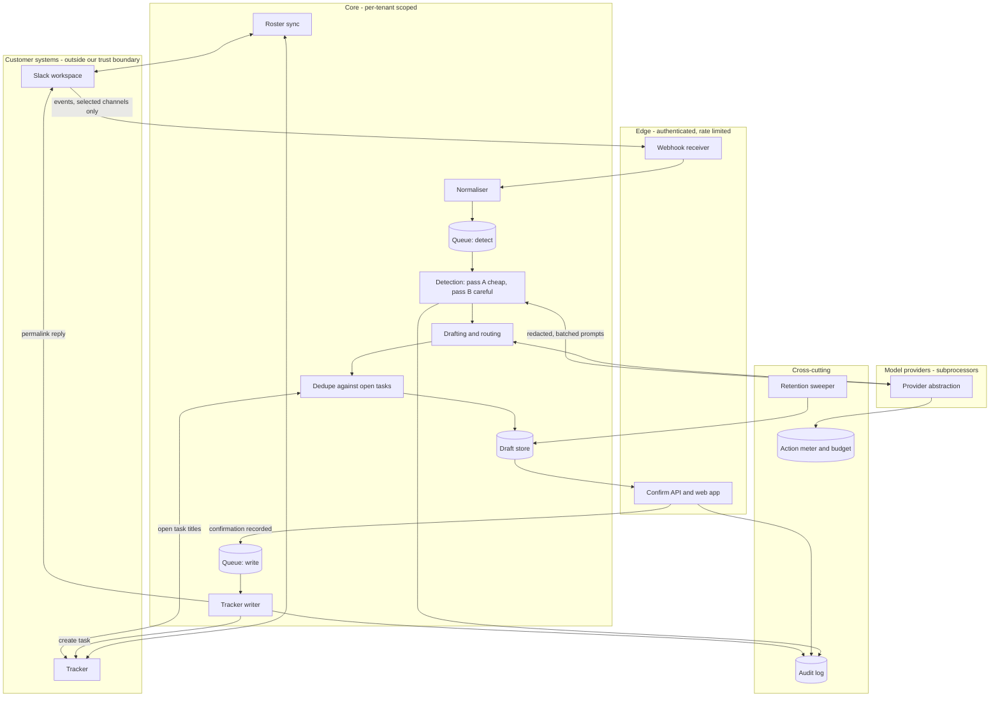

# Architecture — v0

Working draft. Nothing described here has been built. This document describes the *shape*
of the v0 system: the components, the flow between them, the boundaries that matter, and
the failure behaviour. It deliberately does not name a language, framework, database
product, queue product, cloud or model vendor. Those are open decisions
([ADR 0003](adr/0003-language-and-runtime.md), [ADR 0004](adr/0004-model-provider-strategy.md)),
and a document that quietly assumed one would make the decision without making it.

Where a property is required rather than optional, it says "must". Where something is an
assumption, it is marked **ASSUMPTION**.

## 1. What v0 has to do

> Slack, then detection, then a drafted task, then a human confirming it, then a task
> created in one tracker — plus a 7-day replay that shows the capture-rate gap.

Everything below is in service of that sentence. If a component cannot be traced back to
it, the component is not in v0.

## 2. Components

| # | Component | Responsibility | Never does |
|---|---|---|---|
| 1 | **Slack ingest** | Receive events from the selected channels, normalise them into `SourceMessage` records, group them into threads and time windows | Interpret content; call a model; write anything back to Slack |
| 2 | **Replay reader** | Pull the last 7 (up to 30) days of history for selected channels at connect time and feed it through the same normalisation | Behave differently from live ingest, beyond rate pacing |
| 3 | **Detection pipeline** | Decide which messages contain a commitment, request or decision; produce `Candidate` records with a confidence and a reason | Write to a tracker; make an assignment final |
| 4 | **Drafting and routing** | Turn a candidate into a `Draft`: title, outcome, acceptance condition, suggested owner, suggested due date, labels, source permalink | Guess a due date that is not in the text |
| 5 | **Dedupe** | Suppress drafts matching an already-open task in the connected tracker, or an earlier draft for the same commitment | Delete anything; it marks, it does not erase |
| 6 | **Draft store** | Hold drafts and their state machine (`pending`, `confirmed`, `rejected`, `expired`, `superseded`) | Hold state that the audit log cannot reconstruct |
| 7 | **Confirm API and UI** | Present the queue, accept confirm / edit / reject from an authenticated member, in the web app and via a Slack message action | Accept a confirmation from anything that is not an authenticated human session |
| 8 | **Tracker writer** | Create the task, set assignee and due date, attach the source link, write the task URL back into the source thread | Run without a confirmation id |
| 9 | **Metering** | Record every model call and every billable action with token counts and estimated cost; enforce per-workspace budget caps | Be optional, or be sampled |
| 10 | **Audit log** | Append-only record of every action taken by the system or a user, exportable by the customer | Be mutable, or contain message bodies |
| 11 | **Roster sync** | Maintain the workspace member list and the tracker user list, and the mapping between them | Invent a mapping it is not confident about |
| 12 | **Scheduler and workers** | Run batches, retries, retention sweeps, replay jobs, budget resets | Do work inline in a web request |

Two components are the entire trust story and should be reviewed as such: the **confirm
API** (rule 1) and the **metering** path (rule 3).

## 3. Data flow

The important structural facts in that diagram:

1. **The only path to a customer's tracker or chat runs through `API` then `Q2`.** There
   is no arrow from detection to the tracker. This is rule 1, expressed as topology.
2. **The only path to a model provider runs through the provider abstraction**, and its
   only exit arrow goes to the meter. This is rule 3, expressed as topology.
3. **Dedupe reads the tracker but never writes it.** Read and write use different
   credentials paths and different code paths, so a bug in dedupe cannot create a task.

## 4. Trust boundaries

| Boundary | Crossing | Control |
|---|---|---|
| Internet to edge | Slack event webhooks | Signature verification with the Slack signing secret, replay window rejection, per-workspace rate limit, body size cap |
| Internet to edge | Browser sessions | Session cookie, CSRF protection, per-member authorisation on every workspace-scoped read and write |
| Internet to edge | Slack message actions | Slack request signature plus a mapping from Slack user to a Seros `Member`; an unmapped Slack user cannot confirm |
| Core to provider | Prompt payloads | Redaction and minimisation before the call, no training-permitted terms, provider is a named subprocessor |
| Core to tracker | Task writes | Confirmation id required, workspace-scoped credentials, idempotency key |
| Tenant to tenant | Every query | Workspace id in the primary key path and in every predicate; see section 8 |
| Operator to production | Human access | Break-glass only, MFA, logged, never bulk reads of customer content; see [SECURITY-CONTROLS.md](SECURITY-CONTROLS.md) |

The uncomfortable one to state plainly: **customer message content leaves our systems and
goes to a model provider.** That is the product. The mitigations are minimisation (send
the minimum window of text needed), no-training contractual terms, a published
subprocessor list, and the ability to swap providers quickly.

## 5. Where the model calls sit

There are exactly three places a model is called in v0, and each has a budget and a
purpose recorded on every call.

| Purpose | Input shape | Output shape | Model tier | Notes |
|---|---|---|---|---|
| `detect` | A batch of normalised messages from one channel and time window, with author handles pseudonymised, stripped of attachments and links where possible | For each message id: is-candidate boolean, type (commitment / request / decision), confidence, a short reason | Cheapest capable | Runs on everything. This is where cost lives, so it is the batch-heaviest call |
| `draft` | One candidate plus a bounded window of surrounding thread context | Title, outcome, acceptance condition, mentioned people, suggested labels | Mid tier | Runs only on candidates that survive pass A and dedupe |
| `route` | The draft plus the roster and, in v1, load and history signals | A ranked owner suggestion with a reason string, or an explicit abstention | Mid tier, or heuristic-only if evaluation shows no lift | Must be able to say "I do not know", which produces a round-robin fallback |

Rules for all three:

- Every call goes through the provider abstraction ([ADR 0004](adr/0004-model-provider-strategy.md)).
- Every call carries a prompt version id which is stored on the resulting record, so any
  suggestion can be traced to the exact prompt that produced it.
- Every call is bounded: maximum input tokens, maximum output tokens, timeout, retry
  budget. An unbounded call is a bug.
- No call happens inside a web request. All three run in workers.
- Structured output is validated before it is trusted. A malformed response is a failed
  call, not a partial result to be parsed hopefully.

**ASSUMPTION:** a cheap classifier pass over batched messages is enough for first-pass
detection at acceptable precision. This is unproven and is exactly what the golden set in
[TESTING-STRATEGY.md](TESTING-STRATEGY.md) exists to measure. If it is false, the cost
model changes and the pricing assumptions need revisiting.

## 6. Queueing, batching and idempotency

**Queues.** At least two logical queues, with separate concurrency and separate failure
behaviour: `detect` (slow, expensive, retryable, may be delayed by hours without harm) and
`write` (fast, side-effecting, must not be delayed, must never double-fire). A third,
`maintenance`, carries retention sweeps, roster sync and replay backfill so that a large
replay cannot starve live traffic.

**Batching.** Messages are grouped by channel and by a time window (**ASSUMPTION:** five
minutes for live traffic, whole-day chunks for replay) before detection. Batching is the
main cost lever: one call over forty messages costs far less than forty calls. Batch size
is capped by input tokens, not by message count.

**Idempotency.** Every stage must be safe to run twice, because every queue will
eventually deliver twice.

| Stage | Idempotency key | Behaviour on repeat |
|---|---|---|
| Ingest | `(workspace_id, slack_channel_id, slack_ts)` | Upsert, no duplicate `SourceMessage` |
| Detect | `(batch_id, prompt_version)` | Result cached; a repeat within the cache window costs nothing |
| Draft | `(candidate_id, prompt_version)` | One draft per candidate per prompt version |
| Confirm | `(draft_id, member_id)` | First confirmation wins; a second returns the same confirmation |
| Tracker write | `(confirmation_id)` sent as the provider idempotency key where supported, plus a local unique constraint | Returns the existing task; never creates a second |
| Thread reply | `(task_id)` | One reply per task |

Where a tracker does not support idempotency keys, the writer performs a
create-then-record in a single logical step and, on ambiguous failure, searches the
tracker for a task carrying the confirmation id in its metadata or description before
retrying. **The default on ambiguity is to not retry and to raise for human review.** A
duplicate task in a customer's tracker is a trust incident, not a nuisance.

## 7. Failure modes

| Failure | Detection | Behaviour | Customer-visible |
|---|---|---|---|
| Model provider down or degraded | Error rate and latency on the provider abstraction | Detection queue pauses and holds; nothing is lost; drafts already pending are unaffected and can still be confirmed | Status page: "task drafting is queued, confirmation and tracker writes are working" |
| Model provider returns malformed output | Schema validation fails | Retry once with a stricter instruction, then drop the batch to a dead-letter queue for inspection. Never guess at the intent | Nothing, unless sustained |
| Tracker API 429 | Response status | Exponential backoff with jitter, respect `Retry-After`, keep the confirmation queued. The confirmation is durable; the write is retried | A "creating…" state on the confirmed item |
| Tracker API 5xx or timeout after write may have landed | Ambiguous response | Do not retry blindly. Search for the confirmation id, and if unresolved, mark `needs_review` and alert | Item shows as needs attention |
| Slack token revoked | 401 from Slack, or a token revocation event | Stop ingest for that connection, mark the connection broken, email the admin, keep existing drafts | Banner in the app, email |
| Scope removed by the customer | Missing-scope error | Degrade to the features the remaining scopes allow, and say which feature stopped working and why | Explicit message naming the scope |
| Database unavailable | Health checks | Web app returns 503 rather than serving a partial view; workers stop consuming rather than dropping | Status page |
| Budget cap reached | Meter | Hard stop on new model calls for that workspace; confirmation and tracker writes continue; queued messages are held not discarded | In-app notice, email to the workspace admin |
| Poison message (one message repeatedly crashes detection) | Retry count | Dead-letter after N attempts, continue the batch, alert once | Nothing |
| Replay job floods the queue | Queue depth | Replay runs on its own queue with its own concurrency ceiling | Replay shows progress |

The rule behind the table: **degrade toward doing nothing, never toward acting without a
human.** Every failure path ends in either a retry, a hold, or an alert. None of them ends
in a task appearing in a customer's tracker that nobody confirmed.

## 8. Multi-tenancy and isolation

**ASSUMPTION:** one logical database, shared schema, workspace id on every row. This is
the right default for one engineer at v0 scale. Alternatives (schema per tenant, database
per tenant) cost operational complexity that buys little at this size, and can be adopted
later for a specific enterprise customer without redesigning the model.

The isolation strategy therefore has to be enforced in code, and it must be structural
rather than a matter of remembering:

1. **Workspace id is part of every tenant-owned table's primary or composite key**, not a
   loose column.
2. **All data access goes through a scoped accessor** that is constructed with a workspace
   id and refuses to build a query without one. There is no ambient "current workspace"
   global that a background job can forget to set.
3. **Row-level security in the database as the second line**, if the chosen database
   supports it, so that an application bug is not the only thing standing between two
   tenants. Belt and braces; the application check stays either way.
4. **Cross-tenant queries exist only in two places**: aggregate metrics (which read counts
   and never content) and the admin console (which is access-controlled and audited).
   Both are separate code paths that are easy to review.
5. **Tests**: an automated test that fails the build if any tenant-owned table is queried
   without a workspace predicate, and a fixture with two workspaces where every read test
   asserts the other workspace's rows are absent.
6. **Encryption keys for connection secrets are per workspace**, so a leaked ciphertext
   from one tenant is not a leak of all tenants.

This is the engineering answer to `[[TOM_TENANT_ISOLATION]]`; see
[SECURITY-CONTROLS.md](SECURITY-CONTROLS.md).

## 9. Cost control

Gross margin is a design property here, not a finance exercise. The variable cost of a
customer is dominated by model calls, and the plan's margin assumption cannot survive a
naive implementation.

**Design levers, in the order they matter:**

| Lever | Mechanism | Expected effect |
|---|---|---|
| Cheap-model first pass | Pass A is a cheap classifier over batched messages. Only survivors reach the more expensive drafting call | The largest single lever, because most messages are not commitments |
| Batching | Group by channel and window, pack to a token ceiling | Amortises prompt overhead across many messages |
| Prefix caching | Keep the system prompt and instruction block byte-identical across calls so provider prompt caching can apply | Cheaper repeat calls where supported |
| Result caching | Cache on `(content_hash, prompt_version, model)`. Re-running detection over unchanged history is free | Makes replay re-runs and retries cheap |
| Pre-filters before any model call | Skip bot messages, joins and leaves, emoji-only messages, link-only messages, messages below a length floor, channels with no human activity | Removes a large share of volume at zero inference cost |
| Truncation and windowing | Send a bounded context window around a candidate, not the whole thread | Caps worst-case input size |
| Abstention | Route can decline; drafting is skipped when confidence is below a floor | Avoids paying for output nobody will accept |
| Per-workspace budget cap | See below | Bounds the blast radius of a runaway loop or an abusive workspace |

**Budgets and hard stops.** Every workspace has a daily and a monthly inference budget,
derived from its tier and seat count (**ASSUMPTION:** set at a multiple of expected usage,
tuned once real cost per action is measured).

| Threshold | Action |
|---|---|
| 50% of daily budget | Record; no customer-visible effect |
| 80% of daily budget | Internal alert; workspace admin notified if the trend implies a stop before the reset |
| 100% of daily budget | **Hard stop on model calls for that workspace.** Ingest continues and messages are held. Confirmation and tracker writes continue. In-app and email notice explaining exactly what stopped |
| Global daily spend cap | Hard stop across all workspaces, page the on-call. This is the circuit breaker that prevents a bug from becoming an existential invoice |

A hard stop must stop *before* the call, checked in the provider abstraction itself, not
after the fact in a reconciliation job. Anything else is an alert about money already
spent. The meter also emits the internal cost-per-action figure the business plan treats
as the single most important internal number; it is a first-week build, not a later one.

## 10. Security and privacy properties that shape the architecture

- **Retention is a job, not a promise.** A sweeper runs on a schedule, per table, per
  workspace policy, and its runs are recorded. See [DATA-MODEL.md](DATA-MODEL.md) for the
  retention class of each table.
- **Deletion on disconnect.** Disconnecting a source deletes stored message content for
  that source. Deleting a workspace deletes everything except the minimum billing and
  audit records the law requires, and those are content-free.
- **No customer content in logs**, ever. Structured logging with an explicit allowlist of
  fields. Content is referenced by id and hash only. Errors carry ids, never bodies.
- **Secrets** (OAuth tokens, refresh tokens, signing secrets) are encrypted at rest with a
  key from a managed key service, never in configuration files, never in the repository.
- **The audit log is append-only** and exportable by the customer, because the roadmap
  promises exportable audit history in v0.

## 11. What this architecture deliberately does not include

| Not in v0 | Why |
|---|---|
| A second source or a second tracker | Every source multiplies detection tuning rather than adding to it |
| Auto-confirmation of any kind | ADR 0002 |
| A customer-facing API | Nothing is stable enough to be an API |
| A vector store or retrieval layer | There is no evidence yet that detection needs one; adding it early buys an operational component and a cost centre for a hypothesis |
| Fine-tuned or distilled models | Premature before the golden set exists and before there is enough labelled rejection data to be worth anything |
| Microservices | One deployable unit plus workers. One engineer cannot operate a fleet, and nothing here needs independent scaling yet |
| Real-time streaming detection | Batching is the cost lever. Minutes of latency are acceptable for this product; a per-message call is not |

## 12. Open questions

1. Which tracker is v0? This changes the writer, the dedupe read path and the roster
   mapping. Roadmap says: let the first five design partners decide.
2. Language and runtime — [ADR 0003](adr/0003-language-and-runtime.md).
3. Model provider strategy and the cheap-tier choice — [ADR 0004](adr/0004-model-provider-strategy.md).
4. Does the routing suggestion need a model call at all in v0, or does a roster heuristic
   plus explicit-mention parsing get close enough? This is measurable before it is built.
5. Where does the confirm queue live by default — web app or Slack? Both are in scope; the
   default surface shapes the onboarding and the notification design.
