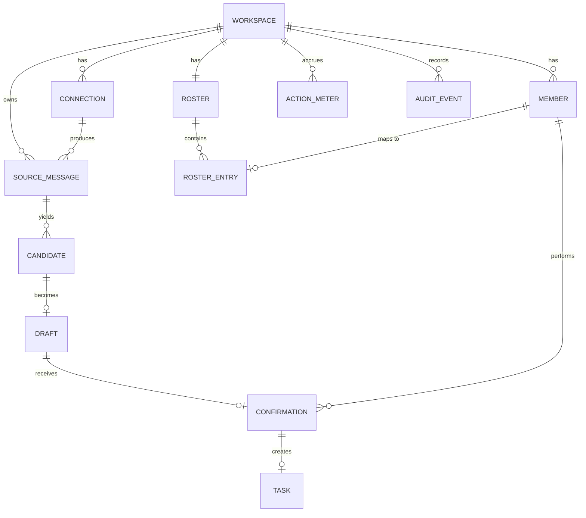

# Data model — v0

Working draft. Nothing here has been built. This document defines the entities the v0 loop
needs, what each field is for, which fields are customer content, and how long each table
is allowed to keep its rows.

The retention part is not documentation hygiene. The privacy policy, the DPA and the
security page make retention and deletion promises, and a promise the schema cannot
implement is a misrepresentation. Every table below has a retention class, and the
retention sweeper described in [ARCHITECTURE.md](ARCHITECTURE.md) enforces it.

No database product, column type system or ORM is assumed. Types are written generically
(`id`, `text`, `timestamp`, `json`, `int`, `bool`, `enum`).

## 1. Classification vocabulary

**Content class** — what kind of data a field holds. This drives what can be logged, what
can be sent to a model provider, and what must be deleted on request.

| Class | Meaning | Rules |
|---|---|---|
| `CONTENT` | Customer content: message text, task titles and bodies, quoted context, file names, anything the customer's people wrote | Never logged. Encrypted at rest. Deleted per retention class. Sent to providers only in minimised form |
| `IDENTITY` | Personal data about individuals: names, emails, avatar URLs, external user ids | Never logged in plain form. Pseudonymised in prompts wherever the task does not require the real name |
| `METADATA` | Ids, timestamps, counts, states, model names, token counts, hashes | Loggable. Survives content deletion so that audit and billing remain intact |
| `SECRET` | OAuth access and refresh tokens, signing secrets, webhook secrets | Encrypted with a per-workspace key. Never logged, never rendered, never exported |

**Retention class** — how long rows may live.

| Class | Default | Configurable range | Applies to |
|---|---|---|---|
| `R-EPHEMERAL` | Delete as soon as the derived record exists, and in all cases within 7 days | not customer configurable | Raw message bodies once a candidate decision is made |
| `R-CONTENT` | 30 days | 7 to 90 days per workspace | Content retained to explain a suggestion and to allow the replay window |
| `R-DERIVED` | 12 months | 3 to 24 months | Drafts, candidates, decisions, stripped of raw bodies |
| `R-OPERATIONAL` | 90 days | fixed | Queue records, job state, provider call envelopes without content |
| `R-AUDIT` | 12 months, exportable | 12 to 24 months | Audit events. Content-free by construction |
| `R-BILLING` | 7 years | fixed, statutory | Meter aggregates and invoice lines. Content-free |
| `R-ACCOUNT` | Life of the account plus 30 days | fixed | Workspace, member and connection records |

**ASSUMPTION:** the defaults above are drafts. They must be reconciled with the final
`[[RETENTION_*]]` values in the published privacy policy before launch; the numbers in the
legal pack are the ones that bind.

## 2. Entity relationships

The chain that matters: `SourceMessage -> Candidate -> Draft -> Confirmation -> Task`. A
`Task` cannot exist without a `Confirmation`, and the foreign key makes that structural
rather than a matter of discipline.

## 3. Entities

### 3.1 Workspace

One customer tenant. Everything else hangs off this.

| Field | Type | Class | Notes |
|---|---|---|---|
| `id` | id | METADATA | Primary key; appears in every tenant-owned table |
| `name` | text | IDENTITY | Customer-chosen display name |
| `slug` | text | METADATA | URL segment, unique |
| `tier` | enum | METADATA | `trial`, `starter`, `team` |
| `seats` | int | METADATA | Billed quantity |
| `billing_customer_ref` | text | METADATA | Payment provider reference; no card data is ever stored here |
| `retention_content_days` | int | METADATA | 7-90, default 30. Drives the sweeper |
| `retention_derived_months` | int | METADATA | 3-24, default 12 |
| `daily_budget_cents` | int | METADATA | Inference hard stop |
| `monthly_budget_cents` | int | METADATA | Inference hard stop |
| `data_region` | enum | METADATA | v0: US only. Present so v2 residency is not a migration |
| `status` | enum | METADATA | `active`, `suspended`, `deleting`, `deleted` |
| `created_at`, `updated_at`, `deleted_at` | timestamp | METADATA | |

**Retention:** `R-ACCOUNT`. Deleting a workspace cascades to every tenant-owned table
except `ActionMeter` aggregates and `AuditEvent`, which are content-free and are retained
for their own statutory or contractual periods with the workspace id kept as a reference.

### 3.2 Connection

One authorised link to an external system. Slack and one tracker in v0.

| Field | Type | Class | Notes |
|---|---|---|---|
| `id` | id | METADATA | |
| `workspace_id` | id | METADATA | |
| `kind` | enum | METADATA | `slack`, `tracker` |
| `provider` | text | METADATA | Which product. Not fixed in this repository |
| `external_account_id` | text | METADATA | Slack team id, or tracker org id |
| `external_account_name` | text | IDENTITY | Display name of the connected org |
| `scopes_granted` | json | METADATA | Exactly what was granted, for the trust page and for degradation logic |
| `access_token` | text | SECRET | Encrypted with a per-workspace key |
| `refresh_token` | text | SECRET | Encrypted |
| `token_expires_at` | timestamp | METADATA | Drives proactive refresh |
| `installed_by_member_id` | id | METADATA | Who authorised it, for the audit trail |
| `selected_channels` | json | METADATA | Explicit allowlist. Empty means read nothing |
| `status` | enum | METADATA | `active`, `degraded`, `revoked`, `disconnected` |
| `last_error_class` | text | METADATA | Error class only. Never a provider error body, which can contain content |
| `created_at`, `updated_at`, `disconnected_at` | timestamp | METADATA | |

**Retention:** `R-ACCOUNT`. On disconnect: tokens are destroyed immediately, the row is
kept with `status = disconnected` for the audit trail, and all `SourceMessage` content for
that connection is deleted within 24 hours.

### 3.3 SourceMessage

A normalised message from a selected channel. The highest-sensitivity table in the system.

| Field | Type | Class | Notes |
|---|---|---|---|
| `id` | id | METADATA | |
| `workspace_id`, `connection_id` | id | METADATA | |
| `external_channel_id` | text | METADATA | |
| `external_ts` | text | METADATA | Slack timestamp; part of the natural key |
| `thread_key` | text | METADATA | Groups a thread |
| `author_external_id` | text | IDENTITY | Slack user id |
| `author_member_id` | id | METADATA | Resolved Seros member, when known |
| `body` | text | **CONTENT** | The message text. The single most sensitive column |
| `body_hash` | text | METADATA | Stable hash, used for result caching and dedupe after `body` is gone |
| `mentions` | json | IDENTITY | External user ids referenced |
| `permalink` | text | CONTENT | Can reveal channel names; treated as content |
| `has_attachment` | bool | METADATA | Attachments are not fetched or stored in v0 |
| `is_bot` | bool | METADATA | Pre-filter |
| `posted_at` | timestamp | METADATA | |
| `ingested_at` | timestamp | METADATA | |
| `content_purged_at` | timestamp | METADATA | Set when `body` is nulled |

**Retention:** `body`, `permalink` and `mentions` are `R-CONTENT` (default 30 days,
workspace-configurable 7-90). Everything else is `R-DERIVED`. Once a candidate decision
exists and the workspace's window has passed, `body` is nulled and `content_purged_at` is
set; the row survives as metadata so that dedupe, metrics and the audit trail still work.
Rows for messages that produced no candidate can be purged more aggressively
(`R-EPHEMERAL`) — **ASSUMPTION:** keeping non-candidates for the full window is only
useful for evaluation, and evaluation should use the consented fixture corpus instead.

### 3.4 Candidate

A detection decision about one message or a small span of messages.

| Field | Type | Class | Notes |
|---|---|---|---|
| `id` | id | METADATA | |
| `workspace_id` | id | METADATA | |
| `source_message_id` | id | METADATA | |
| `batch_id` | id | METADATA | Which detection batch produced it |
| `kind` | enum | METADATA | `commitment`, `request`, `decision` |
| `confidence` | float | METADATA | Model-reported, calibrated per prompt version |
| `reason` | text | CONTENT | Short model explanation; can quote the message, so treated as content |
| `prompt_version` | text | METADATA | Traceability to the exact prompt |
| `model` | text | METADATA | |
| `suppressed_reason` | enum | METADATA | `duplicate_open_task`, `duplicate_draft`, `below_threshold`, `filtered`, null |
| `created_at` | timestamp | METADATA | |

**Retention:** `R-DERIVED`, with `reason` following `R-CONTENT`.

### 3.5 Draft

The proposed task, before any human has seen it or agreed to it.

| Field | Type | Class | Notes |
|---|---|---|---|
| `id` | id | METADATA | |
| `workspace_id`, `candidate_id` | id | METADATA | |
| `title` | text | **CONTENT** | |
| `outcome` | text | **CONTENT** | What "done" means |
| `acceptance_condition` | text | **CONTENT** | |
| `quoted_context` | text | **CONTENT** | The bounded excerpt shown to the confirmer |
| `source_permalink` | text | CONTENT | |
| `suggested_owner_member_id` | id | METADATA | Nullable. Null means "we do not know", which is a valid answer |
| `owner_reason` | text | CONTENT | "Suggested because…" string |
| `suggested_due_date` | date | METADATA | Only when an explicit date appears in the text. Never guessed |
| `suggested_labels` | json | CONTENT | Customer vocabulary |
| `state` | enum | METADATA | `pending`, `confirmed`, `rejected`, `expired`, `superseded` |
| `prompt_version`, `model` | text | METADATA | |
| `expires_at` | timestamp | METADATA | Pending drafts expire rather than accumulating forever |
| `created_at`, `updated_at` | timestamp | METADATA | |

**Retention:** content fields `R-CONTENT`; state, ids and timings `R-DERIVED`, because
acceptance rate and time-to-confirm are computed from them long after the text is gone.

### 3.6 Confirmation

The human decision. The most legally significant row in the system: it is the evidence
that a person authorised a write.

| Field | Type | Class | Notes |
|---|---|---|---|
| `id` | id | METADATA | |
| `workspace_id`, `draft_id` | id | METADATA | Unique on `draft_id` |
| `member_id` | id | METADATA | Who confirmed. Never a service account |
| `decision` | enum | METADATA | `confirmed`, `confirmed_with_edits`, `rejected` |
| `edited_fields` | json | METADATA | Field names only, never before/after values |
| `edited_payload` | json | **CONTENT** | The final values, when edited |
| `reject_reason` | text | CONTENT | Optional one word from the confirmer |
| `surface` | enum | METADATA | `web`, `slack_action` |
| `client_ip_hash` | text | METADATA | Hashed, for abuse investigation only |
| `decided_at` | timestamp | METADATA | |

**Retention:** `R-DERIVED` for the decision record; content fields `R-CONTENT`. The
decision row itself outlives the draft text, because "a human authorised this" must remain
provable after the content is deleted.

### 3.7 Task

The record of what was created in the tracker. Not a copy of the tracker's data; a pointer
plus the minimum needed to reconcile.

| Field | Type | Class | Notes |
|---|---|---|---|
| `id` | id | METADATA | |
| `workspace_id`, `confirmation_id` | id | METADATA | `confirmation_id` is required and unique |
| `connection_id` | id | METADATA | Which tracker connection wrote it |
| `external_task_id` | text | METADATA | |
| `external_url` | text | CONTENT | Can contain project and title slugs |
| `assignee_member_id` | id | METADATA | |
| `due_date` | date | METADATA | |
| `write_state` | enum | METADATA | `queued`, `created`, `failed`, `needs_review` |
| `idempotency_key` | text | METADATA | Derived from `confirmation_id` |
| `thread_reply_state` | enum | METADATA | `pending`, `posted`, `skipped`, `failed` |
| `completed_at` | timestamp | METADATA | From tracker polling or webhook, for the capture-rate metric |
| `created_at`, `updated_at` | timestamp | METADATA | |

**Retention:** `R-DERIVED`. Deleting a Seros workspace does not delete tasks in the
customer's tracker; that is their data in their system, and the disconnect copy must say
so plainly.

### 3.8 Member

A person who can use Seros in this workspace.

| Field | Type | Class | Notes |
|---|---|---|---|
| `id` | id | METADATA | |
| `workspace_id` | id | METADATA | |
| `email` | text | IDENTITY | Login identity |
| `display_name` | text | IDENTITY | |
| `role` | enum | METADATA | `owner`, `admin`, `confirmer`, `viewer` |
| `auth_provider` | enum | METADATA | v0: email link or password. SSO is v2 |
| `password_hash` | text | SECRET | Modern password hashing function only, if passwords exist at all |
| `mfa_enrolled` | bool | METADATA | |
| `is_billable_seat` | bool | METADATA | |
| `status` | enum | METADATA | `invited`, `active`, `suspended`, `removed` |
| `last_seen_at` | timestamp | METADATA | For the weekly-active-confirmer metric |

**Retention:** `R-ACCOUNT`. On removal, identity fields are cleared and the row is kept as
a tombstone so historical confirmations still resolve to "a person, since removed".

### 3.9 Roster and RosterEntry

The map between people in the source, people in the tracker, and Seros members. Routing is
impossible without it, and getting it wrong is the most visible kind of error the product
can make.

**Roster** — one per workspace: `id`, `workspace_id`, `last_synced_at`,
`sync_state`, `entry_count`. All `METADATA`.

**RosterEntry**

| Field | Type | Class | Notes |
|---|---|---|---|
| `id` | id | METADATA | |
| `workspace_id`, `roster_id` | id | METADATA | |
| `member_id` | id | METADATA | Nullable; not everyone in Slack is a Seros member |
| `source_external_id` | text | IDENTITY | Slack user id |
| `source_handle` | text | IDENTITY | |
| `tracker_external_id` | text | IDENTITY | |
| `tracker_handle` | text | IDENTITY | |
| `mapping_confidence` | enum | METADATA | `explicit`, `email_match`, `inferred`, `unmapped` |
| `assignable` | bool | METADATA | Admin can exclude people from routing |
| `round_robin_cursor` | int | METADATA | Fallback fairness |

**Retention:** `R-ACCOUNT`. An `inferred` mapping must never be used for an assignment
without showing the confirmer what it inferred and why.

### 3.10 ActionMeter

Every model call and every billable action. Rule 3 lives here.

| Field | Type | Class | Notes |
|---|---|---|---|
| `id` | id | METADATA | |
| `workspace_id` | id | METADATA | |
| `purpose` | enum | METADATA | `detect`, `draft`, `route`, `replay`, `other` |
| `provider`, `model` | text | METADATA | |
| `prompt_version` | text | METADATA | |
| `input_tokens`, `output_tokens`, `cached_input_tokens` | int | METADATA | |
| `estimated_cost_micros` | int | METADATA | Priced at call time from a versioned price table |
| `latency_ms` | int | METADATA | |
| `outcome` | enum | METADATA | `ok`, `timeout`, `invalid_output`, `provider_error`, `budget_blocked` |
| `ref_type`, `ref_id` | text, id | METADATA | What the call was for, so cost is attributable to a draft |
| `billable_action` | bool | METADATA | Whether it counts against the customer's action allowance |
| `occurred_at` | timestamp | METADATA | |

**Retention:** raw rows `R-OPERATIONAL` (90 days). Daily per-workspace, per-purpose
aggregates are `R-BILLING` (7 years). This table contains no customer content by
construction, which is what makes long billing retention acceptable.

A `budget_blocked` row is written when a call is refused by the cap. Blocked calls must be
counted, or the system silently stops working and nobody can see why.

### 3.11 AuditEvent

Append-only. Exportable by the customer. Content-free by construction.

| Field | Type | Class | Notes |
|---|---|---|---|
| `id` | id | METADATA | Monotonic |
| `workspace_id` | id | METADATA | |
| `actor_type` | enum | METADATA | `member`, `system`, `operator` |
| `actor_id` | id | METADATA | |
| `action` | text | METADATA | `connection.created`, `channel.selected`, `draft.confirmed`, `task.created`, `retention.swept`, `operator.accessed`, ... |
| `object_type`, `object_id` | text, id | METADATA | |
| `outcome` | enum | METADATA | `ok`, `denied`, `failed` |
| `request_id` | text | METADATA | Correlates with logs |
| `detail` | json | METADATA | Field names, counts, states. **Never values from customer content** |
| `occurred_at` | timestamp | METADATA | |

**Retention:** `R-AUDIT`. Rows are never updated or deleted before their retention window,
including on workspace deletion, because an audit log that can be edited is not one. A
schema-level check and a test should prove `detail` cannot carry content fields.

## 4. Retention summary

| Table | Content fields | Retention class | Deleted on workspace delete |
|---|---|---|---|
| Workspace | name | `R-ACCOUNT` | Yes, after grace |
| Connection | none (secrets destroyed at disconnect) | `R-ACCOUNT` | Yes |
| SourceMessage | body, permalink, mentions | `R-CONTENT` for content, `R-DERIVED` for the rest | Yes, immediately |
| Candidate | reason | `R-DERIVED` | Yes |
| Draft | title, outcome, acceptance, quoted context, labels | `R-CONTENT` / `R-DERIVED` | Yes |
| Confirmation | edited payload, reject reason | `R-CONTENT` / `R-DERIVED` | Content yes, decision record retained content-free |
| Task | external url | `R-DERIVED` | Yes locally; nothing is removed from the customer's tracker |
| Member | email, name | `R-ACCOUNT` | Yes |
| Roster / RosterEntry | handles | `R-ACCOUNT` | Yes |
| ActionMeter | none | `R-OPERATIONAL` raw, `R-BILLING` aggregate | No, content-free |
| AuditEvent | none | `R-AUDIT` | No, content-free |

Two operations must exist and be tested end to end, because they are promised in the legal
pack:

1. **Delete one person's data on request** — locate every row referencing an individual by
   member id and external ids, clear identity and content fields, keep tombstones.
2. **Delete a workspace** — the table above, executed in dependency order, with the audit
   event written last and a completion record the customer can be shown.

## 5. Open questions

1. Should `SourceMessage.body` be stored at all after detection, or only a hash plus the
   bounded excerpt copied into the draft? Not storing it is stronger privacy and cheaper,
   but it makes replay re-runs and evaluation harder. This is the single biggest privacy
   design choice in the model.
2. Are labels and titles from the tracker cached locally for dedupe, or read live every
   time? Caching is faster and cheaper; live reading stores less customer content.
3. Do rejections need a structured taxonomy in v0 (wrong owner, not a task, duplicate,
   already done) rather than a free word? Structured is worth much more for v1 routing,
   and costs one dropdown now.
4. Retention defaults must be reconciled with the final numbers in the published privacy
   policy before launch.
